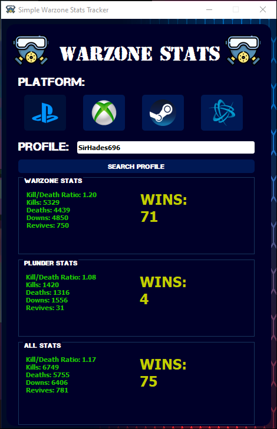
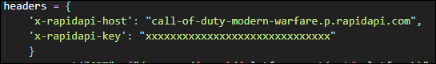
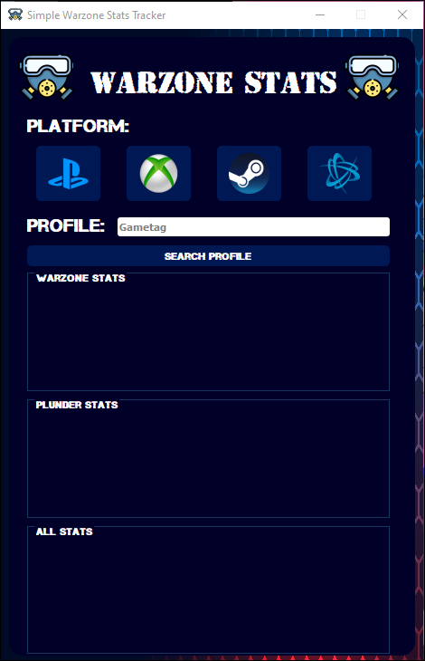
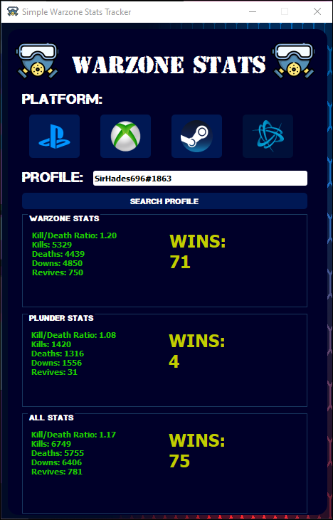
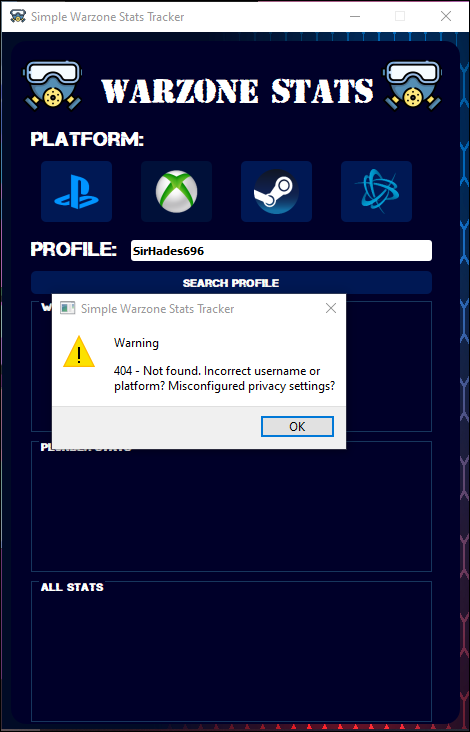

# Warzone Stats Tracker With Python
## A easy and simple warzone stats tracker 

# How to run?
Double click in `main.pyw` 
or 
> `python main.pyw` 

in command prompt.

# What do you need?
We need _PyQt5_ and _x-rapidapi-key_ 

Your _x-rapidapi-key_ find in [Here](https://rapidapi.com/elreco/api/call-of-duty-modern-warfare/details)

and edit `stats.py`

## How to install all Python packages? 
> pip install PyQt5 

# UI and Messages
After run the file `main.pyw` will show this UI.

Select your platform and enter the gametag

if you select Battle.net please enter the gametag with format _#XXXX_

When the profile not found show this message

# Resources
https://pypi.org/project/PyQt5/

https://rapidapi.com/blog/call-of-duty-api-python/
